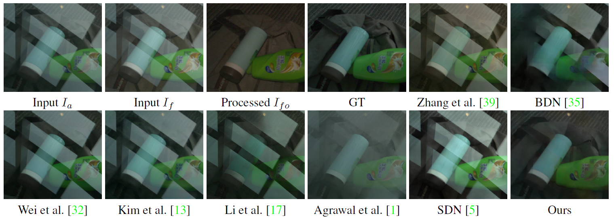

# Robust Reflection Removal with Reflection-free Flash-only Cues (RFC)


### [Paper](https://arxiv.org/pdf/2103.04273.pdf) | [Project Page](https://chenyanglei.github.io/flashrr_rfc/index.html) | [Data](https://hkustconnect-my.sharepoint.com/:u:/g/personal/cleiaa_connect_ust_hk/EWv1afaxrhFKlbT7iX0b8FMB8R1ZeNyUWRQM__A_SPkVGQ?e=8IbhE6) | [Other datasets](https://alexzhao-hugga.github.io/Real-World-Reflection-Removal/) To be released: [Video]()


Tensorflow implementation for: <br>
[Robust Reflection Removal with Reflection-free Flash-only Cues]()  
 [Chenyang Lei](https://chenyanglei.github.io/),
 [Qifeng Chen](https://cqf.io/) <br>
 HKUST
  
in CVPR 2021 
## News
- [x] 2022.03.15 PyTorch version is released

## To Do
- [x] Release test code
- [x] Prepare paper and upload to arxiv
- [x] Make project page
- [x] Release training code
- [x] Release dataset
- [x] Release raw data processing code

## TL;DR quickstart

To setup a conda environment, test on demo data:
```
conda env create -f environment.yml
conda activate flashrr-rfc
bash download.sh
python test.py
```

## Setup

### Environment
This code is based on tensorflow. It has been tested on Ubuntu 18.04 LTS.

Anaconda is recommended: [Ubuntu 18.04](https://www.digitalocean.com/community/tutorials/how-to-install-the-anaconda-python-distribution-on-ubuntu-18-04)
| [Ubuntu 16.04](https://www.digitalocean.com/community/tutorials/how-to-install-the-anaconda-python-distribution-on-ubuntu-16-04)

After installing Anaconda, you can setup the environment simply by

```
conda env create -f environment.yml
```

### Download checkpoint and VGG model

You can download the ckpt and VGG model by
```
bash download.sh
```

## Quick inference 
You can get the results for the demo data by:
```
python test.py
```

If you prepare your own dataset, note that each data sample must contains an ambient image and a flash-only iamge:
```
python test.py --testset /path/to/your/testset
```

## Training 
### Reproduce our results
First, download the dataset:
```
bash download_data.sh
```

Then, you can train a model by
```
python train.py --model YOUR_MODEL_NAME
```

## Raw data preprocessing
First, download raw images on [OneDrive](https://hkustconnect-my.sharepoint.com/:f:/g/personal/cleiaa_connect_ust_hk/EsIM67tInLtAoiWrVCQT1scBar8LO4BwfXJrZr5h0y4mDQ?e=NfDmdy) (70MB for each iamge).

Then, 
```
python rawdata_processing.py
```

Three rgb images will be saved in ./ dir. You can modify the resolutions by yourself in the code.

## What is a RFC (Reflection-free Flash-only Cue)?

The reflection-free cue exploits a flash-only image obtained by subtracting the ambient image from the corresponding flash image in raw data space. The flash-only image is equivalent to an image taken in a dark environment with only a flash on. The reflection disappears in this flash-only image.

Please check our [Project Page](https://chenyanglei.github.io/flashrr_rfc/index.html) for detailed explanation.


## Citation

If you find our work useful for your research, please consider citing the following papers :)

```
@InProceedings{Lei_2021_RFC,
     title={Robust Reflection Removal with Reflection-free Flash-only Cues}, 
     author={Chenyang Lei and Qifeng Chen},
     booktitle = {IEEE/CVF Conference on Computer Vision and Pattern Recognition (CVPR)},
     year = {2021}
}
@ARTICLE{10250963,
  author={Lei, Chenyang and Jiang, Xudong and Chen, Qifeng},
  journal={IEEE Transactions on Pattern Analysis and Machine Intelligence}, 
  title={Robust Reflection Removal With Flash-Only Cues in the Wild}, 
  year={2023},
  volume={45},
  number={12},
  pages={15530-15545},
  doi={10.1109/TPAMI.2023.3314972}}
```
If you are also interested in the polarization reflection removal, please refer to [this work](https://github.com/ChenyangLEI/polarization-reflection-removal).

If you use the synthetic dataset, please cite these two papers since we use their data to synthesize the images:
- [Flash dataset](http://yaksoy.github.io/flashambient/)
- [CoRRN](https://github.com/wanrenjie/CoRRN)

## Contact

Please contact me if there is any question (Chenyang Lei, leichenyang7@gmail.com)


## License

TBD
